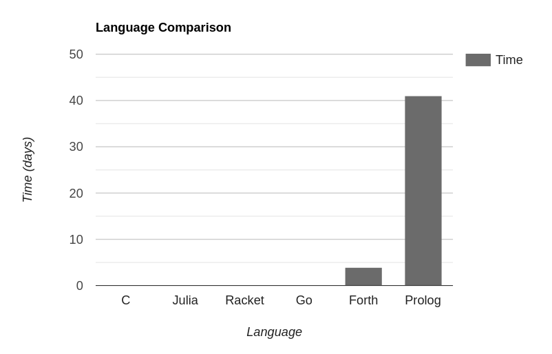

# Approximating 𝑒 in 6½ Programming Languages
I often use programming languages to play around with mathematical problems,
as they are often the fastest option to quickly iterate over ideas.
I have used the usual scripting options, like Python, JavaScript, Julia, Go, and even `bc`.
That left me wanting to compare some of them,
but then I noticed I could use the opportunity to compare a more diverse range of languages.
This is the result of the comparison.

First, I will rate the languages style-wise
(i.e. how much I like every solution).
This also includes readability and elegance.
Afterwards, I will do some actual performance benchmarks,
before finally drawing some conclusions from a mix of both.

## Language 1: Julia
Julia is a simple and beginner-friendly programming language.
It's like Python but better,
and although it has its idiosyncrasies[1](#julia-wierd){.footnote},
I still like it.
It is supposed to be general purpose,
but it shines in mathematical and scientific applications,
so this should be no problem.

As expected,
it's readable enough for me to use it to show the algorithm[2](#julia-wierd){.footnote}.

```julia
setprecision(100_000)

function E(k)
	approx = BigFloat(1) + BigFloat(1/2)^k
	for i in 1:k
		approx = approx * approx
	end
	return approx
end

println(E(10_000))
```

The readability of the code is the best of all the languages,
and the ability to use underscores in numbers is appreciated.
The only thing I didn't like was the global `setprecision` state.
Although Julia does allow a local syntax,
similar to Python's `with` (which I dislike as well),
the variables seem to get rounded after the scope ends,
making it completely useless.

I'll give it a 9/10 style-wise.

## Language 2: Go
The best way I could describe Go is that it's what C++ should have been.
It is way safer, has a nicer syntax,
and neat features, like better multithreading and a better type system,
with a reasonable performance trade-off.
Being honest, initially I was sure it was going to be the best out of the bunch.
It's the language I prefer using for most of my projects.
It even has arbitrary precision floats in the standard library.
The expectation made the disappointment even worse.

```go
package main

import (
	"fmt"
	"math/big"
)

func E(k int) *big.Float {
	approx := big.NewFloat(1.0)
	approx.SetPrec(100_000)
	power := big.NewFloat(0)
	power.SetPrec(100_000)
	twoToTheNth(power, -k)

	approx.Add(approx, power)

	for i := 0; i < k; i++ {
		approx.Mul(approx, approx)
	}

	return approx
}

func twoToTheNth(value *big.Float, power int) *big.Float {
	value.SetFloat64(1)
	value.SetMantExp(value, power)
	return value
}

func main() {
	fmt.Println(E(10_000))
}
```

No good at all.
This is where Go shows its lacking features,
like operator overloading.
It isn't particularly unreadable,
but having everything being methods is noisy and semantically lacking.
It's unclear by the name that the `.Add()` and `.Mul()` methods mutate the variables
with the result of the operation.
Also, there is no included power function.
At least it also allows underscores in numbers.

I'll give it a 3/10.

## Language 3: C
What is there left to say about C?
It is half a century old, yet it is still the building block of modern software.
It is simple and allows you to think in a low-level way that makes the experience
of coding so enjoyable that you almost forget about all the segmentation fault edge cases in your program.
It is probably better suited for some clever bitwise algorithm,
so I came into it without expecting much.

```c
// gcc e.c -o e -lgmp
#include <stdio.h>
#include <gmp.h>

void E(mpf_t approx, unsigned int k) {
	mpf_t base;
	mpf_init2(approx, 100000);
	mpf_set_d(approx, 1);

	mpf_init2(base, 100000);
	mpf_set_d(base, 2);
	mpf_pow_ui(base, base, k);
	mpf_div(base, approx, base);

	mpf_add(approx, base, approx);

	for (int i = 0; i < k; i++) {
		mpf_mul(approx, approx, approx);
	}

	mpf_clear(base);
}

int main(int argc, char** argv) {
	mpf_t approx;
	E(approx, 10000);
	gmp_printf("%.Ff\n", approx);
	mpf_clear(approx);
	return 0;
}
```

As expected, it is just like Go, but with more initialisation and freeing.
To be honest, I like it more.
The operation functions have three arguments,
so the assignment is clearer.
Also, the library came with a built-in power function, a big plus.

It deserves a 4/10.

## Language 4: Lisp (Racket)
Lisp is the most undeniably elegant programming language there is.
Its simplicity is beautiful,
yet it can do everything and more than any other language.
It is also 64 years old.
You do have to get used to the parentheses,
but it ceases to be a problem after a while of using it.
I chose Racket as the dialect of choice,
which has both a typed and untyped version.

```
#lang racket
(require math/bigfloat)

(bf-precision 100000)

(define (E k) 
  (define approx (bf+ (bf 1) (bfexp2 (bf (- k)))))
  (for ([i (in-range k)])
    (set! approx (bf* approx approx))
  )
  approx
)

(display (bigfloat->string (E 10000)))
```

The result is way better than the last two.
I would argue that it is as readable as Julia's,
but with a different notation system.
I like the separation of mutations (`set!`) from definitions (`define`) in variables.
The only noticeable problem is the lack of type-specific functions[3](#lisp-macro){.footnote} with the same name (a.k.a. ad hoc polymorphism),
leading to names like `bf+`.

I may be biased, but I'll give it an 8/10

## Language 5: Forth
Forth is the ultimate fun language.
It forces you to think differently about programming,
having no option but to simplify everything to its essence.
This is because everything in Forth centers around the stack,
and all code is just manipulations of that stack.
No variables or any of the other nonsense.

Writing a program feels like solving a puzzle.
I had to download a BigInt library from a website not updated since the 90s
and make my own fixed-point number type,
but it was still the best of the programming experiences.

```forth
INCLUDE fixed.fth

: E ( k:int -- e:big )
	s" 1" make_fixed over      ( k 1 k )
	s" 2" make_fixed swap      ( k 1 2 k )
	fixed^                     ( k 1 2^k )
	fixed/                     ( k 1/2^k)
	s" 1" make_fixed fixed+    ( k 1+1/2^k, where 1+1/2^k is the approximation )

	swap 0 do dup fixed* loop
;

: main cr 1000 E big. ;
```

It is the most concise of the bunch,
ignoring the stack comments.
You might have noticed the spaces after the quotes.
They are necessary.
It won't win any awards for readability,
but it makes up for it in grace and simplicity.

A 5/10 is reasonable.

## Language 6: Prolog
Prolog is one of the most interesting programming languages[4](#prolog-conference){.footnote}.
It changes completely how you approach problems,
and throws nearly everything you know about out the window.
It is based on logic,
and can easily solve some problems that take other languages hundreds of lines.

To be honest, I was hesitant to add it to the list,
as it is definitely not the tool for the job.

```prolog
e(Iterations, Approximation) :-
	Original is 1 + rational((1/2)**Iterations),
	e(Original, Iterations, Approximation).

e(Approximation, 0, Approximation).
e(Original, ItersLeft, Approximation) :-
	ItersLeftMinusOne is ItersLeft-1,
	e(Original, ItersLeftMinusOne, LeverLower),
	Approximation is LeverLower * LeverLower.

main :-
	e(25, Approx),
	format("~200f~n", Approx).

```

It is style-wise quite nice,
especially the ability of declaring predicates with different number of arguments (arity).
On the other hand, the `ItersLeftMinusOne` variable is a crime against nature
It is a shame that the code looks more procedural than anything else,
considering it's Prolog.

It gets a 7/10.

But, as you'll see, the style isn't the problem here.

## Bonus Language 6½: Spreadsheets
They may not count as a programming language,
but they are definitely an important piece of software,
and great for playing around and visualizing things.
Unsurprisingly, this was the version which took me the least time to make,
just a couple of minutes.

|     | A         | B         | C   | D                          |
| --- | --------- | --------- | --- | ---                        |
| **1**   | **Iteration** | **Value**     |     | **m**                          |
| **2**   | 0         | =1+1/2^D2 |     | 25                         |
| **3**   | =A2+1     | =B2\*B2   |     |                            |
| **4**   | =A3+1     | =B3\*B3   |     | **e**                          |
| **5**   | =A4+1     | =B4\*B4   |     | =indirect(address(D2+2,2)) |
| **6**   | =A5+1     | =B5\*B5   |     |                            |
| ... | ...       | ...       |     |                            |

Naturally, all the formulas are actually hidden when actually reading it.
That is the main problem with spreadsheets;
they are amazing to write, but not really meant to be read[5](#write-only){.footnote}.

## Performance
Speed is an important and often neglected aspect of programming.
Four of the languages were comparable in speed
and actually managed to approximate 𝑒 with 100 000 binary bits to 10 000 iterations of precision[6](#slow){.footnote}.
For those that did not, I did the test on a smaller scale and extrapolated the results,
giving them the benefit of the doubt.



As expected, the languages without BigFloat libraries did the worst.
Doing it with arbitrary precision fixed-point was slow,
even with lower precision as not to cause a crash.
Prolog seemed to scale horribly with each new iteration,
and when checking the stack trace it seemed to consider the relationship of every
iteration with the last, so it crashed before reaching 30.
It is not made for this.

Eliminating Prolog and Forth:


As expected, C came first, by a bit over 0.3 seconds, including compilation time.
It is the result of sacrificing readability for performance.
On the other hand, Julia was a surprise.
It came second to C, even though it wasn't compiled ahead of time[7](#jit){.footnote}.
With its wonderful legibility,
it is probably the best language for quick, high-precision mathematics,
especially considering the REPL.
Racket was a weird one.
The compiler took 20 seconds to create a 26 MB binary that performed *worse*
than just running the interpreted version.
The interpreted version ran in just under 3 seconds,
which is respectable.

And now, the biggest disappointment: Go.
Not only was it the worst in terms of style,
it also performed far worse than the languages in its category,
even though in includes BigFloats in its standard library.
Do not do maths in Go, I guess.

## Conclusions
- Julia is *really good* for mathematical programming.
- C is C, with no exceptions.
- Don't compile Racket code.
- My honeymoon phase with Go is over.
- I really like writing in Forth.
- Prolog is better left for Prolog tasks.
- I like writing footnotes.

## Footnotes
1. For some reason,
   Julia decided that it is not only possible
   but standardized to use Unicode characters as variables.
   This leads to `x = e` causing an error 
   but `x = 𝑒` being completely fine,
   which is an interesting design choice. {#julia-wierd}

2. For the math people: {#algorithm}

{.small}

3. In reality, this is not much of a problem.
   If I was using BigFloats for anything serious,
   I would just make a macro with simple operator overloading,
   which is trivial in Lisp because it treats code like data.
   For such a small example, it would not make much sense to do so. {#lisp-macro}

4. I would recommend watching [this conference](https://youtu.be/0fpDlAEQio4?t=1277)
   to get a good introduction to Prolog. {#prolog-conference}

5. For write-only programming languages,
   check out APL, Brainfuck, Perl and Java. {#write-only}

6. In reality, the algorithm I chose for approximating 𝑒 is deliberately slow
   because I wanted the programs to stay simple and not need excessively large memory allocations to store numbers.
   A series that converges way quicker is the sum of the multiplicative inverses of all non-negative integer factorials. {#slow}

7. The Julia devs call the compilation "Just Ahead of Time",
   but it is in essence a pimped-up just-in-time compiler,
   like LuaJIT but better. {#jit}

