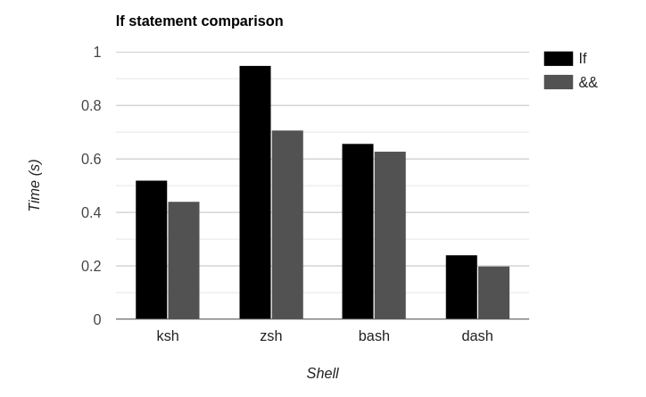
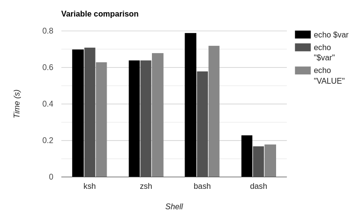

# Testing 3 Common Shell Optimizations
Although worrying about performance in shell scripts seems oxymoronic at first (at least to me),
I have seen enough tips to become curious about the actual benefits of some of them.
So, I decided to put three common ones to the test, with [a few self-made benchmarks](https://github.com/hhhhhhhhhn/bensh).

## Replacing `if` statements with logical operators
The idea is simple, using logical operators (`&&` and `||`) instead of `if` statements.
For example:

```bash
if [ -z "" ]; then
	echo "Empty"
else
	echo "Not empty"
fi
```

Turns into:

```bash
[ -z "" ] \
	&& echo "Empty" \
	|| echo "Not empty"
```

### Results
Running 10000 statements of each kind, 5 times, with 4 different shells, the results are:



We can see that the difference in most shells is small,
except for `zsh`,
which seems to have a specially bad time running `if` statements,
being a full 33% slower than with logical operators.

But I wouldn't go so far as to recommend removing them, as I will explain later.

## Not `cat`ting into another program
This speaks of the possible methods of using a file as a program's input.
I tested 3 options.
The first one is redirecting the file contents using the `<` operator:

```bash
</etc/hostname grep A
```

The second one is the classic and amateurish `cat` pipe:

```bash
cat /etc/hostname | grep A
```

Finally, the third one is simply using the program's file argument:

```bash
grep A /etc/hostname
```

### Results
**NOTE**: Done only with 1000 iterations.


For all shells the results were quite similar,
both the `<` operator and the argument method working at similar speeds,
but piping `cat` showing slightly slower results.
It is worth noting that the performance difference seems constant all 4 shells,
which indicates that the only difference is the `cat` loading.

Thankfully, the least readable of the three is also the slowest.
Never cat into another program when shell scripting.


## Quoting variables
The usage of quotes when surrounding variables is almost always recommended,
as it avoids argument splitting, and [globbing/wildcard expansion](https://tldp.org/LDP/abs/html/globbingref.html).
Interestingly, it may be faster, having to skip all those steps
(At least according to a [SE answer](https://unix.stackexchange.com/a/67131)).
Let's put it to the test:

Firstly, let's consider the two options, without:

```bash
var="a b c d e f g h i j k l m n o p q r s t u v w x y z"
echo $var
```

And with quotes:

```bash
var="a b c d e f g h i j k l m n o p q r s t u v w x y z"
echo "$var"
```

And, just for fun, `echo`ing the value directly:
```bash
var="a b c d e f g h i j k l m n o p q r s t u v w x y z"
echo "a b c d e f g h i j k l m n o p q r s t u v w x y z"
```

### Results



It is definitely the most confusing out of the three graphs.
The performance hit of not using quotes varies from nothing in `zsh`
to over 30% in `bash` to actually being around 10% better in `ksh`.
Moreover, in all shells but `ksh` putting the value directly into `echo` was slower than using a variable.
Thinking it over, it makes sense, as each new string means that a new allocation must be made.
Except for `ksh`, for some reason.

Based on this, and that `ksh` is the least used of the four,
I would recommend using quotes for the variables.


## So what?
Although the difference in the charts may seem dramatic,
they were not made in a context of an actual shell script,
nor with a real user in mind.
If you, like I, use `dash` for running shell scripts,
you are already faster than all other shells.

The testing shows that, in my case,
not using an `if` statement will save an astonishing *single microsecond* off the script.
So what?
Sorry to say it, sometimes the **readability cost** is just not worth it (At least outside loops).
The same cannot be said about the other two optimizations, so go use them.

## Conclusions
- `dash` is ***really*** fast.
- Don't `cat` into another program, anything else is better.
- Use quotes when using variables, except if you want splitting or globbing.
- Feel free to use `if` statements outside loops,
  they will only take a few microseconds longer.

