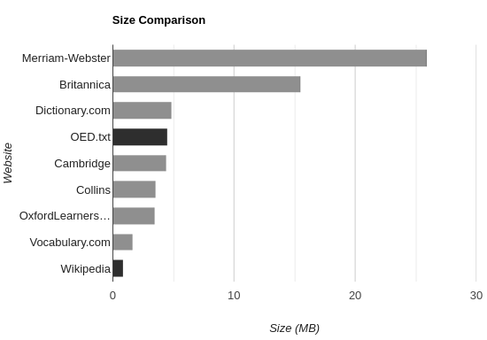

# Markdown: A Patch for the Modern Web
I think it is no secret that websites have become worse with time.
From ads to pop-ups to terrible load times,
it seems that looking stuff up gets harder as every second goes by.
People have tried to reform the Internet.
Projects like [Gopher](https://en.wikipedia.org/wiki/Gopher_(protocol))[1](#gopher){.footnote}
and [Gemini](https://gemini.circumlunar.space/) come to mind.
Although they have been very successful in their niches (including me),
I find it hard to believe regular people are using them.
I think the solution is often overlooked in between attempts to reinvent the wheel.
It is a format that is already widely used: Markdown.

## The Problem
Before going into the details,
let's focus on the actual problem.
The content of the web is obfuscated by unnecessary junk.
Sometimes you just want a definition, or a recipe.
Some ads are understandable,
but it is getting excessive.
And pop-ups just should not exist.

Take dictionaries, as an example.
Definitions are short and simple.
What do websites think about it?

These are the sizes for the definition of "circus".
Notice the black bars.
Wikipedia is the smallest website.
It includes not only a definition, but also its history, uses in modern media, and controversies around animal cruelty.
It also has 25 images related to the topic.
And it is just under a megabyte, loading instantly.
That is why people like it so much: it is straight to the point.
The other black bar is the Oxford English Dictionary in plain text.
The *entire dictionary*.

How do you justify needing almost six times the space of an entire dictionary just for a single definition?
Merriam-Webster is by far the worst website of the bunch.
Not only is it the largest,
it is also the only one with an annoying pop-up.
And to put the size into perspective,
not only is it large enough to fit an entire dictionary,
but also the entire *Harry Potter* series,
a working operating system[2](#kolibri){.footnote},
the first release of *Netscape*,
the first three *Super Mario Bros*,
*Tetris Classic*,
*Super Mario 64*,
*Earthbound*,
*Wolfenstein 3D*,
and the whole Apollo Guidance Computer program that got humans to the moon.
With room to spare.
All that for a simple definition.

## Markdown
Markdown is the perfect alternative to the HTML5 mess we currently have.

It is:
- readable in plain text,
- easy to write,
- not full of unnecessary features, and
- already being used.

It may be the easiest way to fix what we have.
There are already browser extensions that render Markdown documents.
Some flavour of Markdown could be built-in to browsers.
We could also agree on a subset of the HTTP protocol for standard use.
And please, no JavaScript.

> **But what about styling?**

I think styling is a non-issue.
What is the problem with letting users choose a theme for websites?

In truth, I do understand this point.
I do enjoy some fancy backgrounds or animations.
I guess CSS can survive,
or at least a subset of it.

> **But what about interactivity?**

Most interactivity is unnecessary.
I would follow Gemini's lead.
It allows for some basic tasks,
like search engines and inputs,
but not much more.
The most important thing is that it would not replace the normal web,
but be a better, faster alternative for most websites.

> **But what about ads?**

Ads are a necessary part of the Internet.
It is one of the main reasons so much stuff is free.
But recently, the questionable privacy-violating practises have turned public opinion against them.
I think explicitly-marked in-content ads are not a bad thing.
They should be the new standard.
Maybe if ads were not as horrible as they are now,
I would not be using an ad blocker.

> **But what for?**

If you are not convinced by the previous reasons,
I think there are two other important motivations:

- It democratises web development.
  Learning HTML, CSS, and JavaScript is a never-ending process.
  Everyone can learn Markdown in an hour.
  Let normal people have their own website without hassle.
- Less bandwidth is better for the environment.
  Those extra megs [are not cheap](http://dx.doi.org/10.2104/tja09005), you know?

## How?
I would start by installing one of the many Markdown browser extensions.
Markdown versions of websites sound nice.
I plan on doing it with this one[3](#done){.footnote}, after figuring out RSS.
I like this approach the best because it is less annoying.
Adding an extension is a one-and-done thing.
And adding Markdown versions of websites is way easier than having to install a separate Gemini or Gopher server.
To put it simply, it makes use of the stuff we already have.

Humans are lazy.
Do not fight it.
Work around it.

## Footnotes
1. In truth, Gopher was created around the same time as HTTP,
  but lost the competition. 
  Its simplicity has given it a bit of a resurgence recently. {#gopher}

2. Specifically, [KolibriOS](http://kolibrios.org/en/). {#kolibri}

3. [Done](https://hhhhhhhhhn.com/md/index.md)

Tags: Programming, Opinion
Mon Jul  4 10:08:44 PM -04 2022
